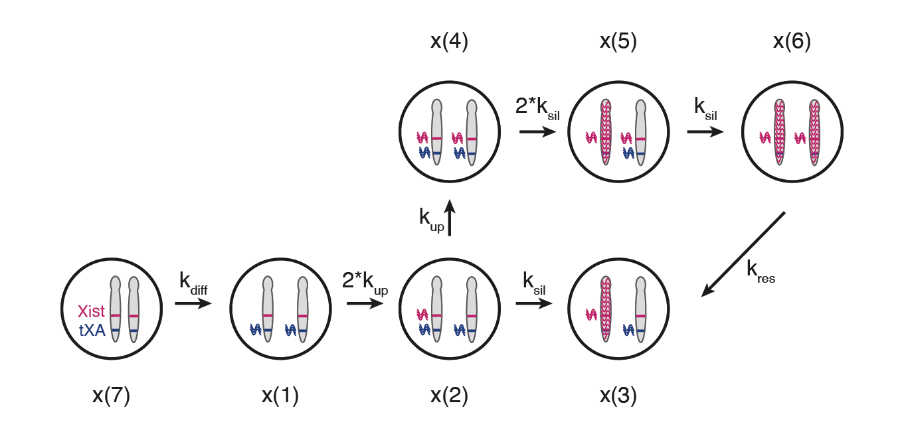

# Mathematical Model of Xist upregulation at the onset of XCI

Ordinary Differential Equation (ODE) model used to estimate timescales of Xist upregulation (symmetry breaking) and negative feedback (silencing) at the onset of X-chromosome inactivation. 
To fit the model parameters, we used RNA-FISH data of Xist expression in vivo mouse development published in (Shiura and Abe, 2019).
The data summarized can be found here: `data/shiura_abe_2019.txt`. The first row corresponds to the timepoints (0, 6, 12, 18, 24, 48 hours correspond to E4.5, E4.75, E5.0, E5.25, E5.5, E6.5 of the paper). The second to fourth rows correspond respecitvely to percent of Xist-negative cells, percent of Xist-monoallelic cells and percent of Xist-biallelic cells.

## Schematic representation & Parameters

Schematic representation of the mathematical model used to estimate timescales of Xist upregulation and negative feedback. A system of ordinary differential equations with one variable describing each of the indicated cell states was fitted to the data to estimate the rates with which cells transition between states.

x(7): undifferentiated Xist-negative cells

x(1): differentiated Xist-negative cell

x(2): Xist-monoallelic and X not silenced cells

x(3): Xist-monoallelic and X silenced cells

x(4): Xist-biallelic and X not silenced cells

x(5): Xist-biallelic and one X silenced cells

x(6): Xist-biallelic and both Xs silenced cells

The differential equations describing the model can be found in the script `./scripts/feedback_model.m`. 

## How to run model
Below is an outline of the `./scripts/simulation.m` script in MATLAB.

First we read the in vivo RNA-FISH data from Shiura and Abe, 2019.

We then explore the ODE solution with a set of random preselected parameters and plot the solution overlayed with the data points. The plot is saved in `./figures` folder as pdf.

Then we fit the model to the data, using random starting values for the parameters. 
The distance function that calculates the distance of the simulated data and the real data, and that the `lsqnonlin` solver is aiming to minimize, is in the script `./scripts/model_fit.m` . The fitted parameters can be found in `/output/fitted_parameters.txt`.

Lastly, we estimate how robust the fit is, by checking how fast the residuals of the model exceed 10% of their best-fit value, when changing the parameter values within a certain range. For each parameter range, the residuals are saved as `.xlsx` files in `./robustness_data` folder, where the first column corresponds to the percent change (`1+i`) of the parameter best-fit value (`k(param)*(1+i)`) and the second column to the residual.
A summary Excel is attached (`./robustness_data/robustness_summary.xlsx`), where the range of parameter values for a ±10% fit is highlighted for each parameter in the tab "residuals".

### Parameter explanation
k_upx2=k1; % Xist upregulation rate when there are two Xs to upregulate Xist

k_up=k_upx2/2; % Xist upregulation rate

k_silx2=k2; % X-chromosome silencing rate when there are two Xs to be silenced 

k_sil=k_silx2/2; % X-chromosome silencing rate

k_res=k3; % Biallelic resolution (conversion to monoallelic) rate

k_diff=k4; % differentiation rate

k5; % delay

We consider t=0 h at E4.5, however this is not necessarily the time when the upregulation starts. It is simply the latest experimental timepoint for which we have data indicating that Xist upregulation has not begun. Therefore, we add the parameter of the delay (k5) to account for the difference in the time where the upregulation starts.

## Notes
Tested using MATLAB version: 9.7.0.1190202 (R2019b)

OS: MarIuX64 2.0 GNU/Linux

## References
Shiura, H. and Abe, K. (2019). Xist/Tsix expression dynamics during mouse peri-implantation development revealed by whole-mount 3D RNA-FISH. Sci. Rep. 9, 3637.
